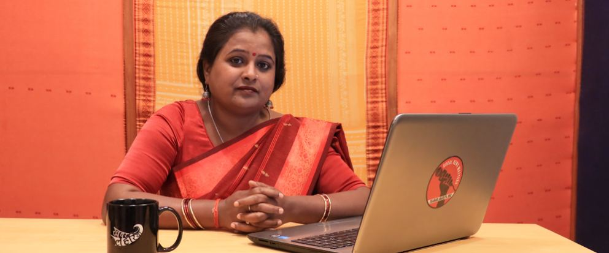

## Kavita Devi

**People wouldn’t think of me as a journalist: Kavita Devi, editor-in-chief, Khabar Lahariya**

Khabar Lahariya, a news website that focuses on rural news told from a feminist perspective. Started in 2002 as a Bundeli newspaper, KL employs Dalit, Muslim, adivasi and Other Backward Class women as reporters and editors. The Editor-in-Chief of Khabar Lahariya, Kavita Devi, is all about the field. Starting as a field reporter she has ventured into the kaccha roads of remote villages that might not even appear on your maps. That’s what Devi’s journalism is about.
